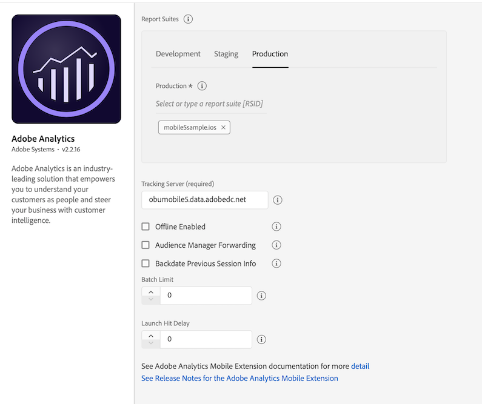

# Adobe Analytics Android Extension

The [`Analytics`](https://developer.adobe.com/client-sdks/documentation/adobe-analytics/) extension represents the Analytics Adobe Experience Platform SDK that is required for sending mobile interaction data from your app to Adobe Analytics.

## Configure the Analytics extension in Data Collection UI



1. Log into [Adobe Experience Platform Data Collection](https://experience.adobe.com/data-collection).
2. From **Tags**, locate or search for your Tag mobile property.
3. In your mobile property, select **Extensions** tab.
4. On the Catalog tab, locate the Adobe Analytics extension, and select Install.
5. Type the extension settings.
6. Click **Save**.
7. Follow the publishing process to update SDK configuration.

## Add Analytics extension to your app

The Analytics extension depends on the Core and Identity extensions:
* [Mobile Core](https://github.com/adobe/aepsdk-core-android)
* [Identity](https://github.com/adobe/aepsdk-core-android)

1. Installation via [Maven](https://maven.apache.org/) & [Gradle](https://gradle.org/) is the easiest and recommended way to get the Mobile SDK. Add a dependency on Analytics and Mobile Core to your mobile application. To ensure consistent builds, it is best to explicitly specify the dependency version and update them manually.

   ```
   implementation 'com.adobe.marketing.mobile:core:2.+'
   implementation 'com.adobe.marketing.mobile:identity:2.+'
   implementation 'com.adobe.marketing.mobile:analytics:2.+'
   ```

> **Warning**  
> Using dynamic dependency versions is not recommended for production apps. Refer to this [page](https://github.com/adobe/aepsdk-core-android/blob/main/Documentation/MobileCore/gradle-dependencies.md) for managing Gradle dependencies.

2. Import MobileCore, Identity and Analytics extensions:

   ### Java

   ```java
   import com.adobe.marketing.mobile.MobileCore;
   import com.adobe.marketing.mobile.Identity;
   import com.adobe.marketing.mobile.Analytics;
   ```

   ### Kotlin

   ```kotlin
   import com.adobe.marketing.mobile.MobileCore
   import com.adobe.marketing.mobile.Identity
   import com.adobe.marketing.mobile.Analytics
   ```

3. Import the Analytics library into your project and register it with `MobileCore`

   ### Java

   ```java
   public class MainApp extends Application {
        private final String ENVIRONMENT_FILE_ID = "YOUR_APP_ENVIRONMENT_ID";

        @Override
        public void onCreate() {
            super.onCreate();

            MobileCore.setApplication(this);
            MobileCore.configureWithAppID(ENVIRONMENT_FILE_ID);

            List<Class<? extends Extension>> extensions = Arrays.asList(
                    Analytics.EXTENSION, Identity.EXTENSION);
            MobileCore.registerExtensions(extensions, o -> {
                Log.d(LOG_TAG, "AEP Mobile SDK is initialized");
            });
        }
    }
   ```

   ### Kotlin

   ```kotlin
   class MyApp : Application() {
       val ENVIRONMENT_FILE_ID = "YOUR_APP_ENVIRONMENT_ID"

       override fun onCreate() {
           super.onCreate()
           MobileCore.setApplication(this)
           MobileCore.configureWithAppID(ENVIRONMENT_FILE_ID)

           val extensions = listOf(Analytics.EXTENSION, Identity.EXTENSION)
           MobileCore.registerExtensions(extensions) {
               Log.d(LOG_TAG, "AEP Mobile SDK is initialized")
           }
       }
   }
   ```

## Next Steps

Get familiar with the various APIs offered by the Analytics extension by checking out the [API reference](./api-reference.md).
